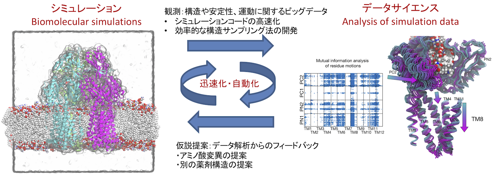

生命現象の多くはタンパク質というヒモ状の分子が担っています。タンパク質は数十億年におよぶ進化の結果として獲得された神秘的なふるまいを備えている一方で、多くの病気にも関与している重要な研究対象です。
タンパク質はとても複雑であり、数千から数十万個の原子からできています。このように複雑なものをどのようにして調べることができるでしょうか？
私たちはこの問題に対し情報工学からアプローチしています。コンピュータの仮想空間の中でタンパク質を構築し、自然法則を真似て詳しく観察する手法(シミュレーション)を開発し応用する。
そしてそこから得られたビッグデータもコンピュータに理解させ(データサイエンス)、次の仮説を作り出しシミュレーションを行う。
このサイクルを迅速・自動的にまわすフレームワークを確立することでタンパク質のふるまいを理解し制御する、具体的にはタンパク質機能を改善する合理的デザインや薬剤設計へ貢献することが目標です。

  

 

ミオグロビンという小さなタンパク質の構造 

  

 

研究戦略の概要 

## シミュレーションの高速化・効率化

分子シミュレーションは計算顕微鏡(computational microscope)とも呼ばれているように、
ミクロな世界のふるまいを観察する有力な手法のひとつです。
その意味で、分子シミュレーションの理論やアルゴリズムを開発することは、
顕微鏡の開発と同じく工学的な課題のひとつと言えます。

我々が取り組んでいるシミュレーション技法のひとつである分子動力学法(molecular dynamics simulation)は、
中学校で習うニュートンの運動法則(力=質量×加速度)を数値的に解く手法です。これは非常にシンプルな手法で、
原子間距離を計算してそこから各原子に働く力を計算して原子の座標をアップデートする、
それを繰り返すことで時間発展させる、ということをやっています。
たったこれだけことですが、そこからタンパク質がどうふるまうのかを詳しく調べることができます。
具体的には、どのような構造が安定か？構造変化が起こりやすいか？どうやって構造変化するか?
薬剤がどれくらい結合しやすいか？薬剤と構造安定性の関係は?他のタンパク質と結合しやすいか？
といった多くの性質を定量化することができます。

しかしながら分子動力学法の欠点は「遅い」ということです。
たとえば、タンパク質が構造を変えて機能する時間スケールはおよそミリ秒(10の-3乗秒)ですが、
分子動力学シミュレーションの1ステップはフェムト秒(10の-15乗秒)です。
ミリ秒に到達するためには、10の12乗回のアップデート計算が必要ですが、
スーパーコンピュータを用いたとしてもむずかしいのが現状です。
また、薬剤が結合するかを計算するのも1薬剤あたりおよそ一日かかってしまいます。
これでは数万個の薬剤候補を網羅的に評価することはむずかしいです。

我々はこの「遅い」という欠点を克服しようと研究しています。
計算を速くする方法のひとつは、シミュレーションのプログラムを並列化することです。
例えば、各原子を近いもの同士でグループに分けて、別々のコンピュータに保有させて
力の計算(原子間距離の計算)を行うことは有効な並列化のひとつです(もちろんグループ間の移動も毎回起こります)。
うまく並列化することでスーパーコンピュータ等の並列計算環境で高速に計算することができるようになります。
別の視点で、我々が最近取り組んでいることは、もう少しメタなレベルの並列化です。作成中

## シミュレーションデータ解析法の開発

作成中

## 実験データを統合したモデリング

作成中

## その他

作成中

